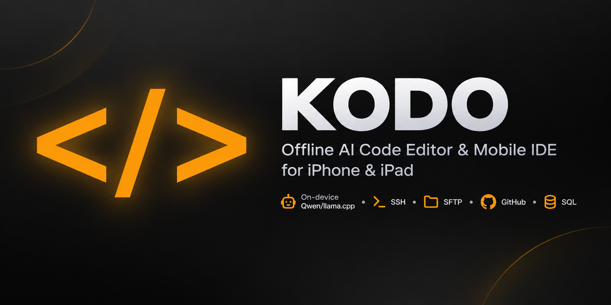

# Kodo Editor

  

  <strong>Private, offline AI code editor & mobile IDE for iPhone and iPad.</strong>

  <a href="https://apps.apple.com/app/id6781042920"><strong>App Store</strong></a>
  ·
  <a href="https://www.kodoeditor.com/"><strong>Website</strong></a>
  ·
  <a href="https://www.kodoeditor.com/guide/"><strong>Documentation</strong></a>
  ·
  <a href="https://www.kodoeditor.com/playground/"><strong>Playground</strong></a>

  iOS 18+ · iPadOS 18+ · Free · No account · On-device AI

---

Kodo brings code editing, on-device AI, an interactive SSH terminal, remote files, GitHub workflows and data tools into one native workspace.

Download a compatible Qwen model once and use AI assistance without sending source code to a cloud AI service.

> This is Kodo's official public documentation, support and issue-tracking repository.  
> The Kodo application source code is proprietary and is not published here.

## Why Kodo?

- **Local-first AI** — run compatible Qwen models directly on your device through `llama.cpp`.
- **More than a code editor** — SSH, SFTP, GitHub, SQL and web development tools live in the same workspace.
- **Designed for iPhone and iPad** — Kodo is built around mobile workflows instead of simply copying a desktop IDE interface.
- **Privacy-focused** — no Kodo account, no cloud AI requirement and no tracking.
- **Free to use** — Kodo currently has no subscription or paywall.

## Code on iPhone and iPad

Kodo is designed for developers who want a useful mobile coding workspace without depending entirely on cloud services.

Edit local projects, preview browser code, work with local data or connect to your own development machines and servers.

| Capability | What Kodo provides |
| --- | --- |
| **Offline AI** | On-device Qwen inference through `llama.cpp` after a model is downloaded |
| **AI editing** | Inline autocomplete, chat and agent edits with reviewable diffs |
| **Remote development** | Interactive SSH terminal plus SFTP and FTP file access |
| **GitHub workflows** | Clone repositories, update local clones and push files |
| **Data tools** | SQLite and PostgreSQL workflows plus CSV/TSV editing |
| **Web development** | HTML, CSS and JavaScript editing with Emmet, formatting and live preview |
| **Editor** | Tabs, version snapshots, reusable snippets and 150+ syntax profiles |
| **Privacy** | No Kodo account, no cloud AI and no tracking |

## A practical iPad workflow

1. Open a local project or start from a [free Kodo template](https://www.kodoeditor.com/templates/).
2. Edit with syntax highlighting, snippets, formatting and optional on-device AI.
3. Review AI-generated changes before applying larger or multi-file edits.
4. Preview HTML, CSS, JavaScript or Markdown locally.
5. Connect over SSH when the project needs a server, compiler or full runtime.
6. Use SFTP, GitHub or database tools when the workflow requires a network.

## Local AI and privacy

Kodo can run compatible coding models directly on supported iPhones and iPads.

- AI prompts and source code are processed on the device by the selected local model.
- Downloaded models can work offline.
- Server credentials are stored in Apple Keychain.
- Network access is used only for actions that require it, such as downloading a model, using GitHub or connecting to a remote server.
- Apple currently lists Kodo as collecting no data.

Read [how local AI and network access work](docs/AI-AND-PRIVACY.md) and the [official privacy page](https://www.kodoeditor.com/privacy/).

## Remote development

Kodo can also act as a mobile companion to a development machine or server.

Use the built-in SSH terminal to run commands remotely and SFTP/FTP to work with files when a project requires runtimes, compilers or services that are not available locally on iOS.

This makes it possible to combine a native mobile editor with your existing development infrastructure.

## Important limits

Kodo is a mobile coding workspace, not a full local replacement for Xcode or a desktop IDE.

- It does not locally execute or compile Python, PHP, Swift or other general-purpose runtimes.
- HTML, CSS, JavaScript and Markdown can be previewed locally.
- A remote machine or server can provide runtimes, compilers and services for larger projects.
- Performance and available AI model sizes depend on the device's memory, storage and thermal conditions.

See the [FAQ](docs/FAQ.md), [remote-development guide](docs/REMOTE-DEVELOPMENT.md) and [official getting-started guide](https://www.kodoeditor.com/guide/).

## Useful links

- [Official website](https://www.kodoeditor.com/)
- [Download Kodo](https://www.kodoeditor.com/download/)
- [Getting-started guide](https://www.kodoeditor.com/guide/)
- [Browser playground](https://www.kodoeditor.com/playground/)
- [Free project templates](https://www.kodoeditor.com/templates/)
- [Privacy](https://www.kodoeditor.com/privacy/)

## Download

Kodo is currently free, with no Kodo account or subscription required.

It requires iOS or iPadOS 18 or later.

**[Download Kodo from the App Store →](https://apps.apple.com/app/id6781042920)**

## Feedback and support

Feedback is welcome.

- Found a reproducible problem? [Open a bug report](https://github.com/TiberiusTech/kodo-editor/issues/new?template=bug_report.yml).
- Have a workflow improvement in mind? [Request a feature](https://github.com/TiberiusTech/kodo-editor/issues/new?template=feature_request.yml).
- Need private help? See [SUPPORT.md](SUPPORT.md).
- Found a security issue? Follow [SECURITY.md](SECURITY.md) and do not post it publicly.

Please never include passwords, private keys, access tokens, server addresses, private source code or confidential logs in a public issue.

## Repository scope

This repository contains public product documentation, release information and community templates.

Documentation fixes and improvements are welcome.

It does **not** contain:

- Kodo application source code
- downloadable AI models
- third-party runtime binaries
- proprietary implementation details

The Kodo application itself is closed-source proprietary software.

---

  <strong>Your code. Anywhere.</strong>

  <a href="https://www.kodoeditor.com/">kodoeditor.com</a>

© 2026 TT Studio. Kodo and its application code are proprietary software.
